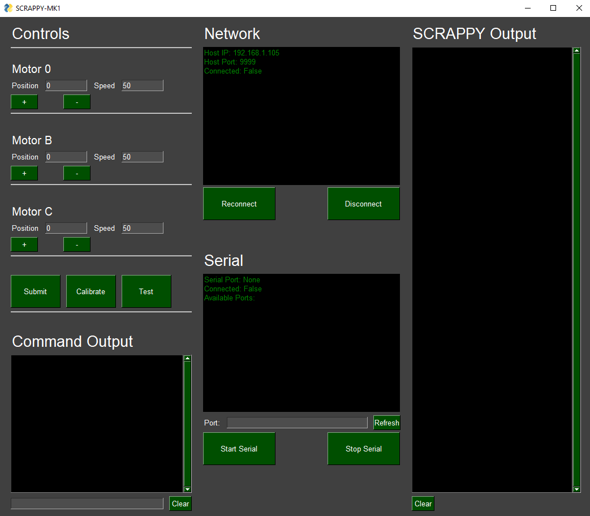

# SCRAPPY-MK1
 A 3D printed robot arm. View documents in project_files for a complete description.
 
 This arm was developed over a 4 week period as an engineering demonstration. Inspired by a previous project, HUEBERT MK2, SCRAPPY consist mostly of 3D printed components and is controllable over the internet (IoT).

The goals of project SCRAPPY were too design and build a robot arm which

1. is highly modular
2. inexpensive
3. had at least 3 DoF
4. could be controlled wireless over a websocket or similar
5. was position and speed controllable
6. used a variety of electrical components (for demonstration purposes)

Other requirements of the specific design can be found in project_files.

The code contained in this respository is designed to run on a 30pin ESP32 Dev module. A python GUI interface is also contained.

This project is ongoing. More details on the use and implementation of this code will be posted when available.
